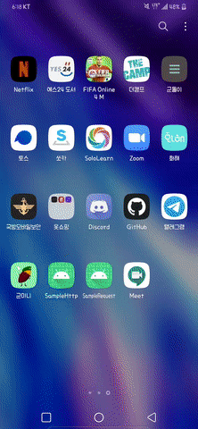
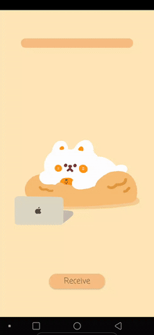
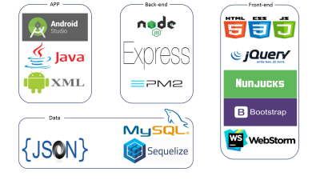

# 팀 로고 (Team Logo)

## 프로젝트 소개 (Project  Introduction)
 안녕하십니까. '군'인들이 쓰는 국'민'앱! 군미니(군민이)를 개발하고 있는 군미니들입니다.  
 군미니는 스마트폰 비대면 반납 앱으로써 스마트폰의 홈화면을 잠그고 푸는 것을 통해 스마트폰의 반납하고 불출 받습니다. 또한, 앱의 반납과 불출 기능을 사용할 때 디바이스의 정보를 서버에 전송하도록 하여, 웹페이지를 통해 한 눈에 병사들의 스마트폰 사용 현황을 보고 관리할 수 있도록 관리자(당직계통)를 위한 서비스를 제공합니다.
 

## 프로젝트 발표영상 (Presentation Video)

## 프로젝트 사용법 (Getting Started)
 - 사용자용 앱(병사)  
    
  1. 앱을 켠다.  
  1. Return 버튼을 누르면 반납완료되면서 잠금화면이 뜬다.   
  1. 스피너를 클릭해서 출타여부를 선택한다.(없으면 그냥 놔둔다.)  
  1. Receive 버튼을 누르면 화면잠금이 풀린다.  
  
 - 관리자용 웹사이트(당직계통)
  1.
  1.
  1.

## 기능 설계 (Function Design)

## 버전 업데이트시 추가할 기능 (Next Update)
- 유동병력 관제  
 PX, 체력단련실 등 주요 편의시설이나 막사 내부 시설에 각각 고유한 UUID를 가지고 있는 비콘을 설치합니다. 앱에서는 백그라운드 서비스를 실행시켜 따로 앱을 키거나 특정 기능이나 행동을 하지 않아도 비콘 근처를 지나가면 자동으로 서비스가 비콘으로부터 UUID를 받고 그 UUID를 해당 스마트폰의 단말아이디와 함께 서버로 전송하도록 합니다. 관리자는 서버로 받은 데이터를 통해 웹페이지에서 병사들이 현재 어느 시설을 이용하고 있는지 바로 볼 수 있게 됩니다.

- 비대면 점호  
 코로나로 인해 많은 인원이 한자리에 모이는 것이 꺼려지는 현 시점에 이전방식의 점호는 필요한 것이면서도 다시 생각 해볼 필요가 있다고 생각했습니다. 그래서 앱을 통해 점호를 하는 것이 어떤가 생각을 해보았습니다. 점호 방식은 간단한 설문을 작성하는 방식과 같습니다. 아픈곳은 없는지, 체온은 몇도인지, 특이사항 및 건의사항은 없는지 등등 점호간 사관들이 점검하는 내용들을 설문에 넣을 수 있을 것입니다. 이 설문은 서버를 통해 웹페이지에서 특이사항들만 추려 보여지게되고 이를 통해 적은 수의 당직계통이 많은 인원의 병사들의 특이사항들을 한 눈에 볼 수 있게 될것입니다. 이 기능이 더욱 기대되는 것은, 개인적인 건의사항이나 특이사항들을 보통 점호 끝나고 사관에게 혼자 찾아가 많은데 이 부분을 개인적인 설문을 통해 쉽게 말할 수 있다는 점입니다. 이렇게 된다면 당직계통은 병사들의 특이사항을 더 파악하기 쉬워질 것이며 더욱 신속히 대처할 수 있게 될 것입니다.

- 카메라 차단  
 국방 모바일 앱을 이용한 카메라 차단에 관하여 여러 문제가 제시되고 있는 것으로 알고 있습니다. 비콘을 이용해 기능을 켜고 끄는데 비콘이 잘 작동하지 않는 곳도 많아 휴가자들이나 전역자들이 피해를 보고 있는 경우도 많다고 합니다. 또한, 모든 병사가 이 앱을 잘 사용하고 있는지도 확실하지 않고 매일매일 모든 인원을 검사하는 것도 쉽지 않은 일입니다. 따라서 군미니 앱에 이 기능을 추가하려고 하고 있습니다. 백그라운드 서비스를 통해 카메라의 접근을 차단 시키고, 출타나 휴가 등을 갈 때 카메라 차단을 풀어주는 방식으로 구현하려고 합니다. 군미니 앱에서는 기본적으로 스마트폰을 불출 받을때 외출, 외박, 휴가 등등 출타가 있다면 드롭바를 통해 해당사항을 선택하고 불출을 받기 때문에 이를 이용한다면 출타시에만 카메라를 허용하는 기능을 만드는 것도 어렵지 않을 것이라 생각합니다. 또한, 이 앱은 휴대폰을 반납, 불출하는 앱이기에 모든 병사들이 깔아 사용할 수 밖에 없을 것입니다. 그렇기 때문에 모든 병사들의 카메라가 자연스럽게 차단 될것이며 보안의 사각지대가 사라질 것입니다. 게다가 국방 모바일 앱을 잘 사용하는지 확인할 필요도 없게 되어 시간과 인력을 낭비할 필요도 없게 될 것입니다.
 
## 프로젝트의 기대효과 (Expectation)
 - 군부대 스마트폰 관리 예시사례
  1. 당직실에 스마트폰 보관함이 있으며 개인정비 시간이 되면 보관함에서 꺼내가고 반납할 때에는 사관에게 카메라가 차단되어 있는지 확인 받은 후에 제출. 많은 인원이 한번에 몰리다보니 복잡하다고 함. 등록필증은 담당관이 발급하며 스티커로 스마트폰 뒷면에 부착. 담당관 혼자 관리를 한다고 하며 훼손시에 다시 발급받아야 하는 번거로움이 있음.
  1. 대대 행정병이 스마트폰을 관리하며 반납과 불출은 이 행정병을 통해 분대장이 받아옴. 매일매일 휴대폰 관리 장부를 써야한다는 번거로움이 있음. 관리장부에 등록증의 번호를 쓴다고 함.
  1. 복도나 행정반 등에 스마트폰 보관함이 있고 시간이 되면 사관이 열어주고 사용시간이 끝나면 닫음. 외출이나 휴가 등 출타 나갈때만 장부를 작성함. 등록필증은 역시 스티커 형태이며 훼손이나 분실시에 다시 반납 받음. 담당관 혼자 관리하며 실질적으로 등록필증을 잘 부착하고 다니는지는 잘 모른다고함.  
  
 - 군미니 앱을 사용한다면
   
   스마트폰 단말의 SSAID가 서버와 연결되어 있고 등록필증이 사용자(병사)프로필에 저장되어있기 때문에 따로 스티커등을 만들어 관리할 필요가 없으므로 인력과 재산을 절감할 수 있습니다. 또한, 서버에 반납과 불출 여부와 시간 기록이 남기 때문에 번거롭게 매번 수불대장을 작성할 필요도 없어지게 되고 사관들이 일일히 검사할 필요도 없게되어 시간과 재산, 인력 낭비를 막을 수 있을 것입니다. 외출이나 휴가 같은 출타여부도 앱을 통해 서버로 전송되기 때문에 당직계통이 출타인지 아닌지 파악하는것도 훨신 쉬워질 것이며 더욱 정확한 관리가 이루어 질 것입니다. 무엇보다도 웹페이지에서 사용자(병사)등록만 하면 바로 기능을 이용 할 수 있기 때문에 어렵지 않게 서비스를 이용할 수 있을것입니다.
  

## 컴퓨터 구성 / 필수 조건 안내 (Prerequisites)
* 안드로이드 4.1 이상
* ECMAScript 6 지원 브라우저 사용
* 권장: Google Chrome 버젼 77 이상

## 기술 스택 (Technique Used)

## 설치 안내 (Installation Process)
 - apk 파일 다운
 - 스마트폰 단말기에 앱 설치

 
## 팀 정보 (Team Information)
- Kim hyeon woo (khw56184@kookmin.ac.kr), Github Id: ASak1104
- Park jong chan (daisophila@gmail.com), Github Id: daisophila

## 저작권 및 사용권 정보 (Copyleft / End User License)
 * [MIT](https://github.com/osam2020-WEB/Sample-ProjectName-TeamName/blob/master/license.md)
