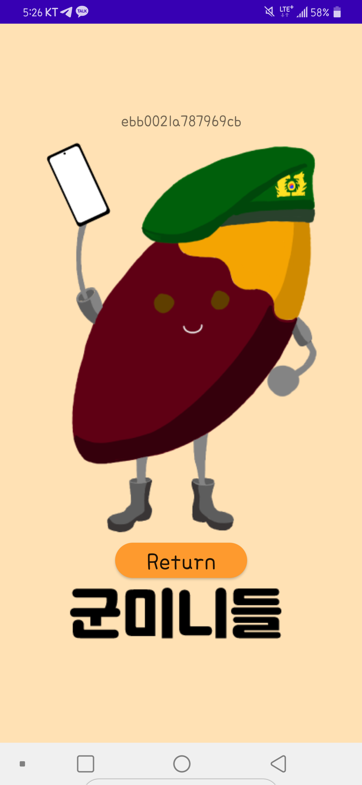
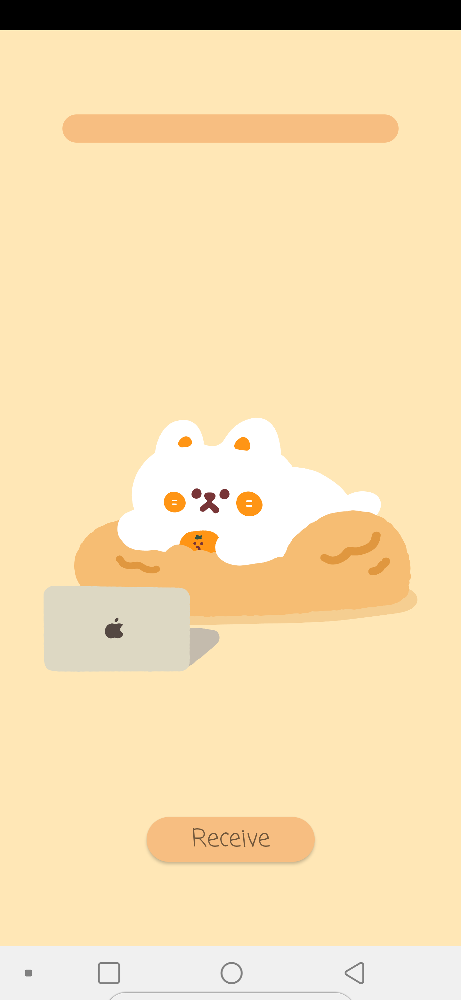
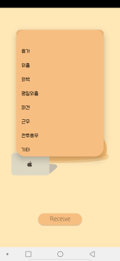

# 팀 로고

## 프로젝트 소개
 안녕하십니까. '군'인들이 쓰는 국'민'앱! 군미니(군민이)를 개발하고 있는 군미니들입니다.  
 군미니는 스마트폰 비대면 반납 앱으로써 스마트폰의 홈화면을 잠그고 푸는 것을 통해 스마트폰의 반납하고 불출 받습니다. 또한, 앱의 반납과 불출 기능을 사용할 때 디바이스의 정보를 서버에 전송하도록 하여, 웹페이지를 통해 한 눈에 병사들의 스마트폰 사용 현황을 보고 관리할 수 있도록 관리자(당직계통)를 위한 서비스를 제공합니다.
 

## 프로젝트 시연 동영상

## 프로젝트 사용법 (Getting Started)
 - 사용자용 앱(병사)
  1. 앱을 켠다.  
  
  1. Return 버튼을 누르면 반납완료되면서 잠금화면이 뜬다.  
  
  1. 스피너를 클릭해서 출타여부를 선택한다.(없으면 그냥 놔둔다.)  
  
  1. Receive 버튼을 누르면 화면잠금이 풀린다.  
    
  
 - 관리자용 웹사이트(당직계통)
  1.
  1.
  1.

## 기능 설계

## 추가할 기능

## 프로젝트의 기대효과

## 컴퓨터 구성 / 필수 조건 안내 (Prerequisites)
* 안드로이드 4.1 이상
* ECMAScript 6 지원 브라우저 사용
* 권장: Google Chrome 버젼 77 이상

## 기술 스택 (Technique Used)
### Server(back-end)
 -  nodejs, php, java 등 서버 언어 버전 
 - express, laravel, sptring boot 등 사용한 프레임워크 
 - DB 등 사용한 다른 프로그램 
 
### front-end
 -  react.js, vue.js 등 사용한 front-end 프레임워크 
 -  UI framework
 - 기타 사용한 라이브러리
 
### Android
 - 안드로이드 스튜디오 사용
 - java, xml
 - android async http 라이브러리 사용

## 설치 안내 (Installation Process)
 - apk 파일 다운
 - 스마트폰 단말기에 앱 설치

 
## 팀 정보 (Team Information)
- Kim hyeon woo (khw56184@kookmin.ac.kr), Github Id: ASak1104
- Park jong chan (daisophila@gmail.com), Github Id: daisophila

## 저작권 및 사용권 정보 (Copyleft / End User License)
 * [MIT](https://github.com/osam2020-WEB/Sample-ProjectName-TeamName/blob/master/license.md)
